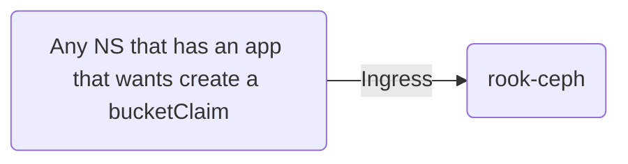
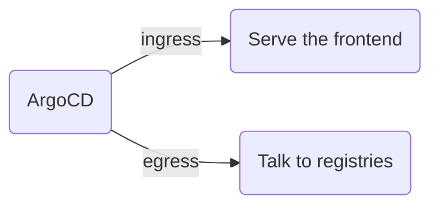

# Network policies

The current state of network policies.

The objective is to ensure that network policies are pressent on every namespace, and if they should not be present, this document will then describe why.

To the best of our abilities we will try and describe, high level, what applications we have in the service layer, and what NS we expect it to be talking to
<!--
By default, a pod is non-isolated for egress; all outbound connections are allowed.
By default, a pod is non-isolated for ingress; all inbound connections are allowed.
-->

A place to get some inspiration:
https://github.com/ahmetb/kubernetes-network-policy-recipes

## Monitoring
Monitoring currently only have two apps that needs to either talk, out of / in to, the monitoring namespace

* Prometheus needs to be able to establish connectins (egress) to most apps outside it's own NS.
* Tempo needs to allow connections (ingress) from most apps outside it's own NS.

The conclusion is that the monitoring namespaces should **allow ingress from all namespaces**, and **allow egress to all namespaces**

The current implimentation of the network policy for the monitoring namespace.  
[monitoring-network-policy.yaml](/yggdrasil/services/monitoring/network-policy.yaml)

## Rook-ceph
Rook-ceph currently only needs to allow the provisioners to be accessed from other namespaces.

* Rook-ceph should not establish any connections out of its own namespace
* Other namespaces should have access to rook-ceph to create a bucketClaim

The conclusion is that the rook-ceph namespace should **allow ingress from all namespaces**, and **disallow egress to all namespaces**

The current implimentation of the network policy for the rook-ceph namespace.  
[rook-ceph-network-policy.yaml](/yggdrasil/services/rook-ceph/network-policy.yaml)

## Yggdrasil
Yggdrasil contains multiple applications, ArogCD and Cilium, Cilium being the app that enforces the network policies, we're only going to worry about ArgoCD for now.

* Yggdrasil should be able to connect to external sources.
* Outside sources should be able to connect to Yggdrasil.

The conclusion is that ArgoCD needs to, currently, **allow ingress connections from external sources** and **Allow egress to external sources**, for serving the frontend and pulling charts and connecting to git repos
