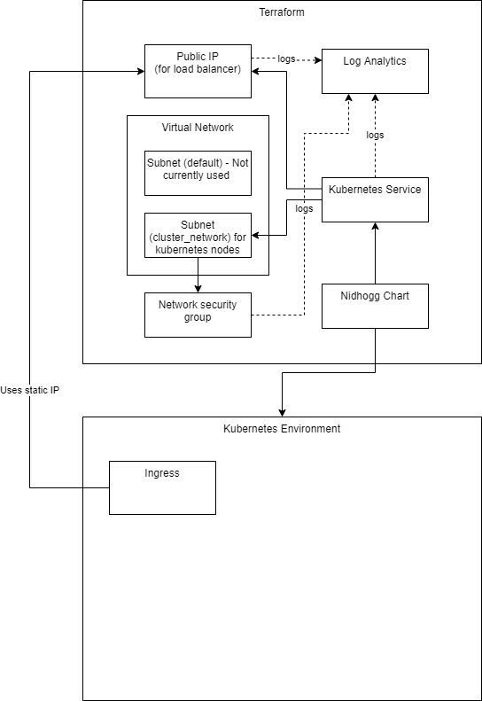

# Terraform Infrastructure
The infrastructure is split up into two parts, one for Azure and one for helm. 



# Azure
Defines all the required Azure resources used to run the infrastructure. 

## Public IP
This is the [Public IP address](https://docs.microsoft.com/en-us/azure/virtual-network/ip-services/public-ip-addresses) used by the Kubernetes service for inbound and outbound traffic. This is configured to be static, in order to maintain the same IP and avoid the need for updating external dependencies. 

Depends on:
- Resource group

## Kubernetes Service
The Kubernetes cluster uses the [Azure Kubernetes Service(AKS)](https://azure.microsoft.com/en-us/services/kubernetes-service/#overview) which deploys nodes within the subnet inside the virtual network. This uses the public-ip for outbound and inbound traffic through a ingress controller.

The Kubernetes service is deployed within the given resource group, however the Kubernetes nodes are deployed within a separate resource group. This resource group is automatically created during creation. The resource group is name using the following pattern:
```
rg-nodes-{name}-{environment_short}-{environment_instance}
```

Depends on:
- Resource group
- Virtual Network
- Public Ip

## Virtual Network
[Azure Virtual Network (VNet)](https://docs.microsoft.com/en-us/azure/virtual-network/virtual-networks-overview) is the private network which used for the Kubernetes nodes to communicate with each other. 

Depends on:
- Resource group
- Network Security Group

### Subnets
During deployment two [Subnets](https://docs.microsoft.com/en-us/azure/virtual-network/network-overview#virtual-network-and-subnets) is created within the Virtual Network. The `default` subnet is currently not being used, however each Kubernetes node get's an ip in the `cluster_network` subnet. 

Both subnets uses the Network security group, to filter network traffic and determaine security rules that allow or deny inbound and outbound traffic. 

Depends on:
- Network Security Group

## Network Security Group
The [Network Security Group (nsg)](https://docs.microsoft.com/en-us/azure/virtual-network/network-security-groups-overview) defines the security rules for both inbound and outbound traffic. This is current set to the default, however this will be narrowed down in the future. 

Depends on:
- Resource group

## Log Analytics
Allows logging across all resources within in the infrastructure. This is yet to be implemented.

# Helm
This Terraform script deploys Nidhogg to the Kubernetes cluster, which then bootstraps the required services. 

Read more about Nidhogg at: [Nidhogg](../nidhogg/README.md)